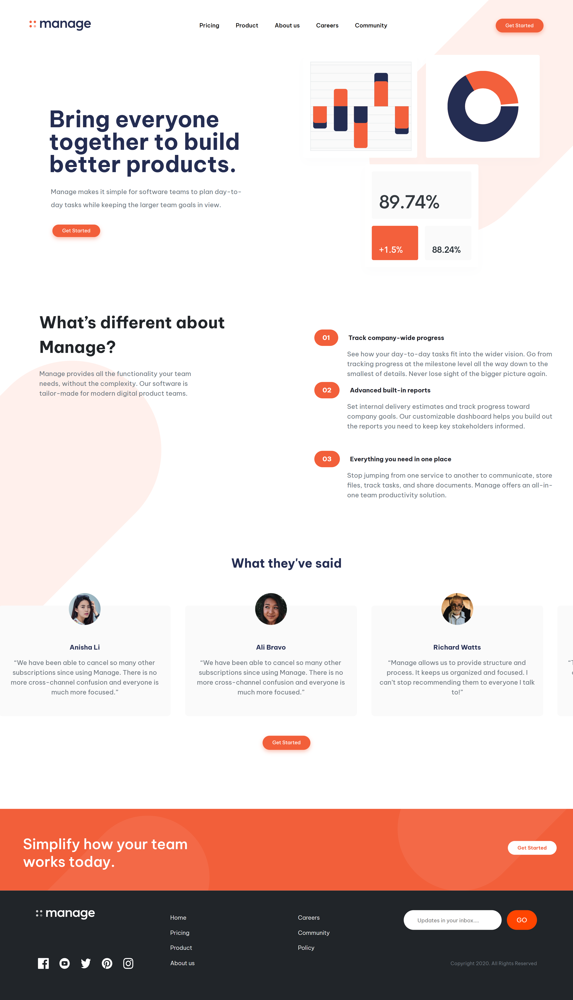

# Frontend Mentor - Manage landing page solution

This is a solution to the [Manage landing page challenge on Frontend Mentor](https://www.frontendmentor.io/challenges/manage-landing-page-SLXqC6P5). Frontend Mentor challenges help you improve your coding skills by building realistic projects.

## Table of contents

- [Overview](#overview)
  - [The challenge](#the-challenge)
  - [Screenshot](#screenshot)
  - [Links](#links)
- [My process](#my-process)
  - [Built with](#built-with)
  - [Useful resources](#useful-resources)
- [Author](#author)

## Overview

### The challenge

Users should be able to:

- View the optimal layout for the site depending on their device's screen size
- See hover states for all interactive elements on the page
- See all testimonials in a horizontal slider
- Receive an error message when the newsletter sign up `form` is submitted if:
  - The `input` field is empty
  - The email address is not formatted correctly

### Screenshot

### Links

- Solution URL: [Github Repo](https://github.com/lianxxxx/frontend-mentor-bootstrap-manage-landing-page)
- Live Site URL: [Netlify](https://manage-landing-page-bootstrap-vite.netlify.app/)

## My process

### Built with

- Semantic HTML5 markup
- CSS custom properties
- Flexbox
- Mobile-first workflow
- [Bootstrap](https://getbootstrap.com/) – CSS framework
- [Vite](https://vitejs.dev/) – Frontend build tool

### Useful resources

- [Google Fonts](https://fonts.google.com/) – This is where I got the font used in this project.

## Author

- GitHub - [@lianxxxx](https://github.com/lianxxxx)
- Frontend Mentor - [@lianxxxx](https://www.frontendmentor.io/profile/lianxxxx)
